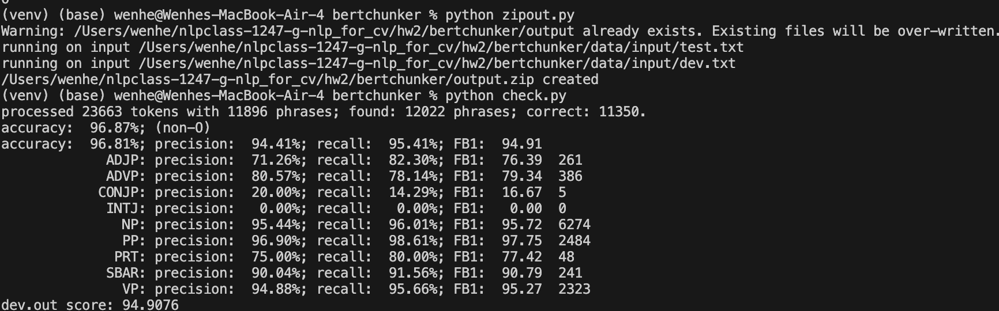

# To obtain the best model file:
1. set up the default working directory as in "./bertchunker/"
2. run python3 answer/bertchunker.py -f -e=10
   - this will run around 20 min, and the best model will be saved in "/data/chunker.pt"

# To obtain performance metric on the dev set:
1. run python3 zipout.py
2. run python3 check.py

# Best model performance on dev set

## The model file is too large (750+ MB) to submit and push to github or CourSys, so it has to be created by running "answer/bertchunker.py"
